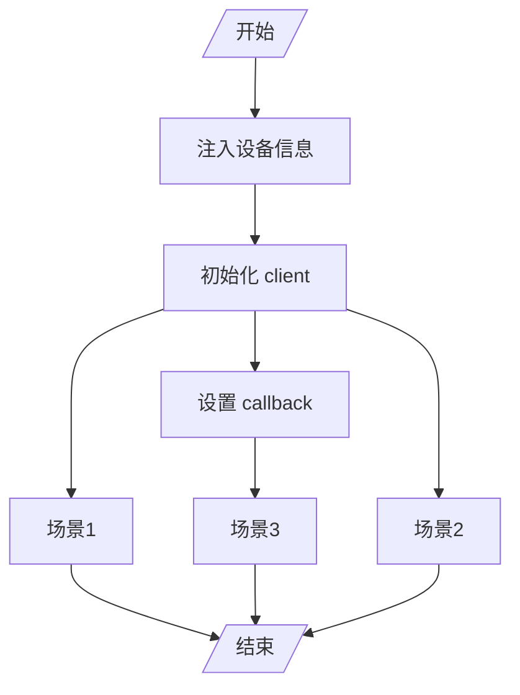

# 简介

本项目可以模拟出现实中的硬件设备，并连接 things board 服务中，同时能够处理

1.  设备单次上报数据到 things board 服务（如，模拟刷卡等场景）；
2. 设备周期上报数据到 things board （如，设备感知到芯片信息持续上报等场景）；
3. 能够处理 things board 下发到设备的命令，并根据命令返回对应数据（如，things board 可以发送开灯命令，设备收到开灯命令后，返回对应开灯结果等场景）。

总之，你可以在项目中虚拟出一个或者多个硬件设备，并且方便的连接到 things board 服务中，来满足业务层的需求。

# 目录

```text
├─java
│  └─com
│      └─taimi
│          ├─callback				mqtt client 回调目录。用来处理场景 3
│          ├─config					配置目录。将设备信息加载到 IoC 中
│          ├─constant				常量目录
│          ├─controller				控制器目录。用来处理场景 1
│          ├─core					项目核心目录。用来初始化设备的 mqtt client，并装配对应设备的 client 和 callback
│          ├─entity					实体目录
│          ├─enums					枚举目录
│          └─schedule				定时任务调度目录。用来处理场景 2
│								
└─resources							配置文件等资源
└─test
    └─java
        └─org
            └─tb
                └─mock				测试目录。
```

# 流程图




# 核心组件

## DeviceConfig

设备配置类。用来将 things board 中添加的设备加载到 IoC 中。

## DeviceHelper

初始化设备的 mqtt client，并装配对应设备的 client 和 callback，同时每个 client 会设置一个监听的主题。该类会在 afterPropertiesSet 方法中为每个设备创建一个 mqtt client，并根据设备类型，设置对应类型的 callback。

<font color=red>MockConstant 中项目需要在启动时，手动配置，否则项目会启动失败。</font>

## MockMqttCallback

空接口，继承了 MqttCallbackExtended 接口，所有设备的 mqtt client 回调处理都需要实现该接口。

# 非核心组件

## SingleController

用来处理场景 1。

## TaskSchedule

定时主动上报的类，使用了 Spring 中自带的调度器，而不是 quartz，场景 2 可以使用此方式。<font color=red>此方式默认不开启</font>，需要开启请在 `DeviceMockApplication` 添加 `@EnableScheduling` 注解。

## XxxMockMqttCallback

实现的 callback 用来处理场景 3。

## SingleTest

场景 1 的测试类。

# 建议、意见和贡献

都可以通过邮箱或者 issue 来联系。

# See Also

如果需要自己 mock 设备参看 —— [增加 mock 设备](./增加 mock 设备.md)
